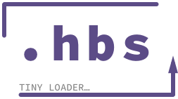

# .hbs tiny loader

Here is a little work around to load your [handelbars](http://handlebarsjs.com) template files (.hbs).

Handelbars is great javascript template engine to work with. But to keep things organized I like to put my templates in separate files. So you need to gather them with a little AJAX call. There is where .hbs tiny loader will make your life easier.

.hbs tiny loader comes in two flavors, asynchronous and synchronous. You can pick one by choosing the right branch of this repo.

## Requirements

-   handelbars
-   jQuery
-   .hbs tiny loader

So you need to include those scripts at the end of your HTML body tag.

```HTML
  [...]
  <script type="text/javascript" charset="utf-8" src="js/jquery.3.2.1.js"></script>
  <script type="text/javascript" charset="utf-8" src="js/handlebars.4.0.11.js"></script>
  <script type="text/javascript" charset="utf-8" src="js/jquery.handlebars.hbs-tiny-loader.min.js"></script>
  <script type="text/javascript" charset="utf-8" src="js/script.js"></script>
</body>
```

## Exemples

Considering this file structure:

```
root/
├── js/
│   ├── handlebars.4.0.11.js
│   ├── jquery.3.2.1.js
│   ├── jquery.handlebars.hbs-tiny-loader.min.js
│   └── script.js
├── templates/
│   └── template.hbs
└── index.html
```

### Asynchronous example
```javascript
var path = 'templates/template.hbs';

var data     = {
  message: 'Hello hbs file!'
};

var deferred = $.getHbs(path);

deferred.then(function(template){
  var html = template(data);
  $('body').prepend(html);
});
```

### Synchronous example
```javascript
var path = 'templates/template.hbs';

var template = $.getHbs(path);

var data     = {
  message: 'Hello hbs file!'
};
var html     = template(data);
$('body').prepend(html);
```

Have fun with handlebars and keep things organized. :wink:
